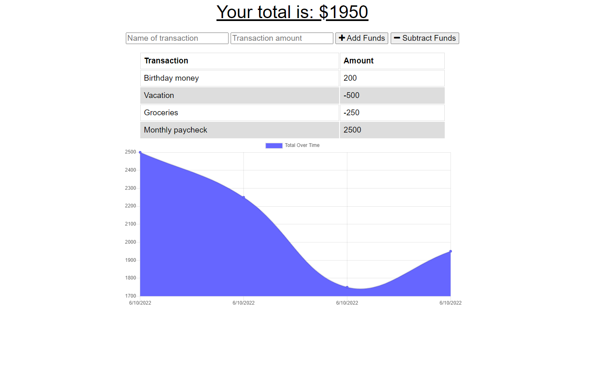

# Budget Tracker

[https://radiant-inlet-28903.herokuapp.com/](https://radiant-inlet-28903.herokuapp.com/)

## Description

This progressive web application allows a user to track their expenses online and offline by making use off cache storage, a service worker and indexedDB.

## Table of Contents

- [Installation](#installation)
- [Usage](#usage)
- [Questions](#questions)

## Installation

Once you visit the site, you will be given the option to download the application. This will allow the application to be used from your device with or without internet access.

## Usage

To use the application, enter a transaction by giving it a name and amount, then select if it is depositing or withdrawing from the total amount. A chart will be presented displaying the total transaction history

## Questions

Have questions? feel free to reach me here:

archied5150@yahoo.com
https://github.com/ArchieDonaho
